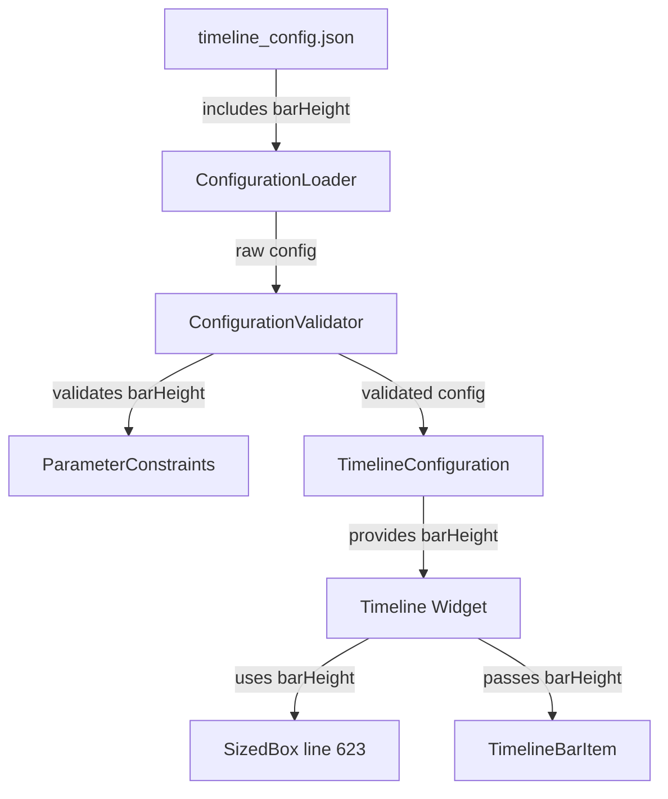

# Design Document: Add barHeight Configuration Parameter

## Overview

This design document describes the implementation of a new `barHeight` configuration parameter for the `swiip_pubdev_timeline` Flutter package. The parameter will control the height of timeline bars, providing developers with more flexibility in customizing the visual appearance of the timeline component.

The implementation leverages the existing external configuration system, adding `barHeight` as a new configurable parameter with validation, serialization, and integration into the Timeline widget. The default value of 70.0 pixels maintains backward compatibility while allowing customization through the configuration file or programmatic API.

## Architecture

### Component Integration



### Data Flow

1. **Configuration Phase**:
   - `barHeight` is defined in `timeline_config.json` (optional)
   - ConfigurationLoader reads the file and parses JSON
   - ConfigurationValidator validates `barHeight` against constraints (40.0 - 150.0)
   - Invalid values are replaced with default (70.0)
   - Validated configuration is stored in TimelineConfiguration

2. **Runtime Phase**:
   - Timeline widget retrieves `barHeight` from TimelineConfiguration
   - `barHeight` is used for SizedBox height at line 623
   - `barHeight` is passed to TimelineBarItem components
   - TimelineBarItem uses `barHeight` for its height property


## Components and Interfaces

### 1. Enhanced TimelineConfiguration

**Responsibility**: Include `barHeight` parameter with serialization support.

**Interface**:
```dart
class TimelineConfiguration {
  // Existing parameters
  final double dayWidth;
  final double dayMargin;
  final double datesHeight;
  final double rowHeight;
  final double rowMargin;
  final int bufferDays;
  final Duration animationDuration;
  
  // New parameter
  final double barHeight;
  
  /// Creates a configuration with explicit parameters
  const TimelineConfiguration({
    this.dayWidth = 45.0,
    this.dayMargin = 5.0,
    this.datesHeight = 65.0,
    this.rowHeight = 30.0,
    this.rowMargin = 3.0,
    this.bufferDays = 5,
    this.animationDuration = const Duration(milliseconds: 220),
    this.barHeight = 70.0,  // New parameter with default
  });
  
  /// Creates a configuration from a map (for JSON loading)
  factory TimelineConfiguration.fromMap(Map<String, dynamic> map) {
    // ... existing parsing logic ...
    
    return TimelineConfiguration(
      // ... existing parameters ...
      barHeight: (map['barHeight'] as num?)?.toDouble() ?? 70.0,
    );
  }
  
  /// Converts configuration to a map
  Map<String, dynamic> toMap() {
    return {
      // ... existing parameters ...
      'barHeight': barHeight,
    };
  }
  
  /// Creates a copy with given fields replaced
  TimelineConfiguration copyWith({
    double? dayWidth,
    double? dayMargin,
    double? datesHeight,
    double? rowHeight,
    double? rowMargin,
    int? bufferDays,
    Duration? animationDuration,
    double? barHeight,  // New parameter
  }) {
    return TimelineConfiguration(
      dayWidth: dayWidth ?? this.dayWidth,
      dayMargin: dayMargin ?? this.dayMargin,
      datesHeight: datesHeight ?? this.datesHeight,
      rowHeight: rowHeight ?? this.rowHeight,
      rowMargin: rowMargin ?? this.rowMargin,
      bufferDays: bufferDays ?? this.bufferDays,
      animationDuration: animationDuration ?? this.animationDuration,
      barHeight: barHeight ?? this.barHeight,
    );
  }
  
  // Update equality and hashCode to include barHeight
  @override
  bool operator ==(Object other) =>
      identical(this, other) ||
      other is TimelineConfiguration &&
          // ... existing comparisons ...
          barHeight == other.barHeight;
  
  @override
  int get hashCode => Object.hash(
        // ... existing parameters ...
        barHeight,
      );
}
```

**Behavior**:
- `barHeight` defaults to 70.0 pixels if not specified
- Serialization includes `barHeight` in map output
- Deserialization parses `barHeight` from map with fallback to default
- `copyWith` supports overriding `barHeight`
- Equality comparison includes `barHeight`

### 2. Enhanced ParameterConstraints

**Responsibility**: Define validation constraints for `barHeight`.

**Interface**:
```dart
class ParameterConstraints {
  // ... existing code ...
  
  /// All parameter constraints for timeline configuration.
  static final Map<String, ParameterConstraints> all = {
    // ... existing parameters ...
    'barHeight': const ParameterConstraints(
      type: 'double',
      min: 40.0,
      max: 150.0,
      defaultValue: 70.0,
    ),
  };
}
```

**Behavior**:
- Validates `barHeight` is a numeric type (double or int)
- Ensures `barHeight` is within range [40.0, 150.0]
- Provides default value of 70.0 for invalid inputs
- Generates range string "40.0 - 150.0" for error messages

### 3. Timeline Widget Integration

**Responsibility**: Use `barHeight` from configuration for timeline bars.

**Interface**:
```dart
class _Timeline extends State<Timeline> {
  late TimelineConfiguration _config;
  late double _barHeight;
  
  @override
  void initState() {
    super.initState();
    
    // Get configuration
    _config = widget.configuration ?? 
              TimelineConfigurationManager.configuration;
    
    // Extract barHeight
    _barHeight = _config.barHeight;
    
    // ... rest of initialization ...
  }
  
  @override
  Widget build(BuildContext context) {
    return Column(
      children: [
        // ... dates section ...
        
        // Timeline bar section (line 623)
        SizedBox(
          height: _barHeight,  // Use configured barHeight
          child: // ... timeline bar content ...
        ),
        
        // ... rest of widget ...
      ],
    );
  }
}
```

**Behavior**:
- Retrieves `barHeight` from active configuration during initialization
- Uses `barHeight` for SizedBox height at line 623
- Passes `barHeight` to TimelineBarItem components
- Updates when configuration changes (after reinitialization)

### 4. TimelineBarItem Integration

**Responsibility**: Use `barHeight` for bar item height.

**Interface**:
```dart
class TimelineBarItem extends StatelessWidget {
  final double height;  // Receives barHeight from parent
  // ... other properties ...
  
  const TimelineBarItem({
    Key? key,
    required this.height,
    // ... other parameters ...
  }) : super(key: key);
  
  @override
  Widget build(BuildContext context) {
    return Container(
      height: height,  // Use provided height
      // ... rest of widget ...
    );
  }
}
```

**Behavior**:
- Accepts `height` parameter from Timeline widget
- Uses `height` for container height
- Maintains existing visual behavior with new configurable height


## Data Models

### Configuration File Format

The `timeline_config.json` file will support the new `barHeight` parameter:

```json
{
  "dayWidth": 45.0,
  "dayMargin": 5.0,
  "datesHeight": 65.0,
  "rowHeight": 30.0,
  "rowMargin": 3.0,
  "bufferDays": 5,
  "animationDurationMs": 220,
  "barHeight": 70.0
}
```

### Configuration Template

The `timeline_config.template.json` will include documentation for `barHeight`:

```json
{
  "_comment": "Timeline Configuration Template",
  
  "barHeight": 70.0,
  "_barHeight_range": "40.0 - 150.0",
  "_barHeight_default": "70.0",
  "_barHeight_description": "Height of timeline bars in pixels",
  "_barHeight_impact": "Larger values provide more vertical space for bar content, smaller values create a more compact timeline",
  
  // ... other parameters ...
}
```

### Validation Constraints

```dart
const barHeightConstraints = ParameterConstraints(
  type: 'double',
  min: 40.0,
  max: 150.0,
  defaultValue: 70.0,
);
```

**Rationale for Range**:
- **Minimum (40.0)**: Ensures bars are tall enough to display content legibly
- **Maximum (150.0)**: Prevents excessively tall bars that waste vertical space
- **Default (70.0)**: Balanced height that works well for most use cases


## Correctness Properties

*A property is a characteristic or behavior that should hold true across all valid executions of a system—essentially, a formal statement about what the system should do. Properties serve as the bridge between human-readable specifications and machine-verifiable correctness guarantees.*

### Property 1: Configuration Serialization Round-trip

*For any* TimelineConfiguration instance with a valid barHeight value, converting it to a Map and back to a TimelineConfiguration should preserve the barHeight value.

**Validates: Requirements 1.4, 1.5**

### Property 2: Out-of-range Values Use Default

*For any* barHeight value outside the range [40.0, 150.0], the validation system should replace it with the default value of 70.0.

**Validates: Requirements 2.2, 2.3**

### Property 3: Invalid Type Uses Default

*For any* barHeight value that is not a numeric type (e.g., string, boolean, null), the validation system should log a warning and use the default value of 70.0.

**Validates: Requirements 2.4**

### Property 4: Error Messages Include Parameter Name

*For any* validation failure on barHeight, the error message should contain the parameter name "barHeight", the provided value, and the expected range.

**Validates: Requirements 2.5**

### Property 5: Default Value When Omitted

*For any* configuration where barHeight is not specified, the system should use the default value of 70.0.

**Validates: Requirements 1.2, 3.3, 7.1, 7.4**


## Error Handling

### Error Categories

1. **Type Errors**:
   - Non-numeric barHeight: Log warning, use default (70.0)
   - Example: `"barHeight": "tall"` → warning + default

2. **Range Errors**:
   - barHeight < 40.0: Log error, use default (70.0)
   - barHeight > 150.0: Log error, use default (70.0)
   - Example: `"barHeight": 200.0` → error + default

3. **Missing Parameter**:
   - barHeight not in config: Silent fallback to default (70.0)
   - No error or warning logged (expected behavior)

### Error Handling Strategy

```dart
// Validation in ConfigurationValidator
final barHeightValue = rawConfig['barHeight'];
final constraints = ParameterConstraints.all['barHeight']!;

if (barHeightValue != null) {
  final result = validateParameter('barHeight', barHeightValue, constraints);
  
  if (result.errors.isNotEmpty) {
    // Log error and use default
    for (final error in result.errors) {
      ConfigurationLogger.validationError(
        'barHeight',
        barHeightValue,
        'double',
        expectedRange: '40.0 - 150.0',
        reason: 'Value out of range',
      );
    }
    validatedConfig['barHeight'] = 70.0;
  } else if (result.warnings.isNotEmpty) {
    // Log warning and use default
    for (final warning in result.warnings) {
      ConfigurationLogger.validationWarning(
        'barHeight',
        barHeightValue,
        'double',
        expectedRange: '40.0 - 150.0',
        reason: 'Invalid type',
      );
    }
    validatedConfig['barHeight'] = 70.0;
  } else {
    // Valid value
    validatedConfig['barHeight'] = barHeightValue;
  }
} else {
  // Not provided, use default
  validatedConfig['barHeight'] = 70.0;
}
```

### Error Messages

**Type Error Example**:
```
[Timeline Config] Validation Warning: barHeight
  Provided: "tall" (String)
  Expected: double, range: 40.0 - 150.0
  Reason: Invalid type
  Using default: 70.0
```

**Range Error Example**:
```
[Timeline Config] Validation Error: barHeight
  Provided: 200.0
  Expected: double, range: 40.0 - 150.0
  Reason: Value out of range
  Using default: 70.0
```


## Testing Strategy

### Dual Testing Approach

The barHeight parameter will be validated using both unit tests and property-based tests:

- **Unit tests**: Verify specific examples, edge cases, and integration points
- **Property tests**: Verify universal properties across randomized inputs

Both testing approaches are complementary and necessary for comprehensive coverage.

### Unit Testing Focus

Unit tests will cover:

1. **Specific Examples**:
   - TimelineConfiguration with barHeight = 70.0 (default)
   - TimelineConfiguration with barHeight = 40.0 (minimum)
   - TimelineConfiguration with barHeight = 150.0 (maximum)
   - TimelineConfiguration with barHeight = 100.0 (mid-range)

2. **Edge Cases**:
   - barHeight exactly at 40.0 (boundary)
   - barHeight exactly at 150.0 (boundary)
   - barHeight = 39.9 (just below minimum)
   - barHeight = 150.1 (just above maximum)
   - barHeight omitted from configuration
   - barHeight = null in configuration

3. **Integration Points**:
   - Timeline widget uses barHeight from configuration
   - TimelineBarItem receives correct barHeight value
   - Configuration changes reflected after reinitialization
   - Backward compatibility (existing code without barHeight)

4. **Type Errors**:
   - barHeight as string: `"barHeight": "70"`
   - barHeight as boolean: `"barHeight": true`
   - barHeight as array: `"barHeight": [70]`
   - barHeight as object: `"barHeight": {"value": 70}`

### Property-Based Testing Focus

Property tests will verify universal correctness properties:

1. **Serialization Property**:
   - Property 1: Round-trip preservation of barHeight

2. **Validation Properties**:
   - Property 2: Out-of-range values always use default
   - Property 3: Invalid types always use default and log warning

3. **Error Handling Properties**:
   - Property 4: Error messages always include parameter name and range

4. **Default Behavior Property**:
   - Property 5: Omitted barHeight always uses default

### Property Test Configuration

- **Minimum iterations**: 100 per property test
- **Test framework**: Dart test package with custom generators
- **Tagging**: Each property test references its design document property
- **Tag format**: `// Feature: add-bar-height-configuration, Property N: [property text]`

### Test Data Generators

Custom generators for property tests:

1. **Valid barHeight Generator**: Random doubles in range [40.0, 150.0]
2. **Invalid Range Generator**: Random doubles outside [40.0, 150.0]
3. **Invalid Type Generator**: Random non-numeric values (strings, booleans, nulls)
4. **Configuration Map Generator**: Random configuration maps with various barHeight values

### Example Property Test Structure

```dart
// Feature: add-bar-height-configuration, Property 2: Out-of-range Values Use Default
test('out-of-range barHeight values use default', () {
  for (int i = 0; i < 100; i++) {
    // Generate random out-of-range value
    final outOfRangeValue = i % 2 == 0
        ? Random().nextDouble() * 40.0  // Below minimum
        : 150.0 + Random().nextDouble() * 100.0;  // Above maximum
    
    final config = {'barHeight': outOfRangeValue};
    
    // Validate
    final result = ConfigurationValidator.validate(config);
    
    // Assert: should use default
    expect(result.validatedConfig['barHeight'], equals(70.0));
    expect(result.errors, isNotEmpty);
  }
});
```


## Implementation Details

### File Modifications

1. **lib/src/timeline/models/timeline_configuration.dart**:
   - Add `barHeight` field with default 70.0
   - Update `fromMap` to parse `barHeight`
   - Update `toMap` to include `barHeight`
   - Update `copyWith` to support `barHeight`
   - Update `operator ==` to compare `barHeight`
   - Update `hashCode` to include `barHeight`
   - Update `toString` to display `barHeight`

2. **lib/src/timeline/models/parameter_constraints.dart**:
   - Add `barHeight` entry to `ParameterConstraints.all` map
   - Define constraints: type=double, min=40.0, max=150.0, default=70.0

3. **lib/src/timeline/timeline.dart**:
   - Retrieve `barHeight` from configuration in `initState`
   - Use `barHeight` for SizedBox height at line 623
   - Pass `barHeight` to TimelineBarItem components

4. **lib/src/timeline/timeline_bar_item.dart**:
   - Add `height` parameter to constructor
   - Use `height` for container height

5. **timeline_config.template.json**:
   - Add `barHeight` with default value and documentation
   - Include range, impact, and usage guidance

6. **CONFIGURATION.md**:
   - Add section documenting `barHeight` parameter
   - Explain purpose, range, default, and visual impact

### Timeline Widget Integration Details

**Current Structure (line 623)**:
```dart
SizedBox(
  height: 70.0,  // Hardcoded value
  child: // ... timeline bar content ...
)
```

**Updated Structure**:
```dart
SizedBox(
  height: _config.barHeight,  // Use configured value
  child: // ... timeline bar content ...
)
```

**TimelineBarItem Update**:
```dart
// Current
TimelineBarItem(
  // ... other properties ...
)

// Updated
TimelineBarItem(
  height: _config.barHeight,
  // ... other properties ...
)
```

### Backward Compatibility

The implementation maintains full backward compatibility:

1. **Default Value**: Existing code without `barHeight` uses 70.0 (same as hardcoded value)
2. **Optional Parameter**: `barHeight` is optional in all constructors
3. **No Breaking Changes**: All existing APIs remain unchanged
4. **Graceful Fallback**: Missing `barHeight` in config files uses default

### Migration Path

For existing users:

1. **No Action Required**: Code continues to work without modification
2. **Opt-in Customization**: Add `barHeight` to config file when desired
3. **Gradual Adoption**: Can customize `barHeight` independently of other parameters
4. **Clear Documentation**: CONFIGURATION.md explains how to use `barHeight`

### Performance Considerations

1. **No Performance Impact**: Adding one field has negligible memory overhead
2. **Same Validation Cost**: Validation follows existing patterns
3. **No Runtime Overhead**: Configuration is loaded once at initialization
4. **Cached Value**: `barHeight` is stored in configuration, not recalculated

### Visual Impact

Different `barHeight` values affect timeline appearance:

- **40.0 (minimum)**: Compact bars, more rows visible, less vertical space per bar
- **70.0 (default)**: Balanced appearance, good readability
- **100.0**: Taller bars, more space for content, fewer rows visible
- **150.0 (maximum)**: Very tall bars, maximum content space, minimal rows visible

The range [40.0, 150.0] provides flexibility while preventing unusable extremes.
