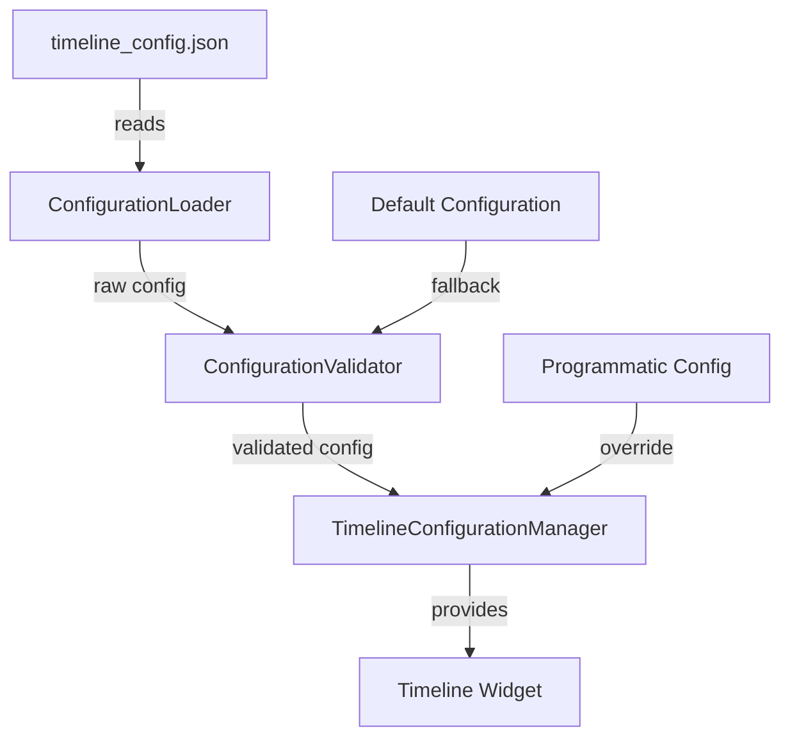

# Design Document: External Configuration System

## Overview

This design document describes the implementation of an external configuration system for the `swiip_pubdev_timeline` Flutter package. The system allows developers to configure timeline performance and rendering parameters through a local JSON configuration file, without modifying the package source code. This approach provides flexibility for optimizing the timeline for different dataset sizes while maintaining backward compatibility.

The configuration system consists of four main components:
1. **ConfigurationLoader**: Loads and parses the JSON configuration file
2. **ConfigurationValidator**: Validates configuration parameters against defined constraints
3. **TimelineConfigurationManager**: Manages the runtime configuration and provides access to it
4. **Enhanced TimelineConfiguration**: Extended to support presets and additional parameters

## Architecture

### Component Diagram



### Data Flow

1. **Initialization Phase**:
   - ConfigurationLoader attempts to read `timeline_config.json` from package root
   - If file exists, parse JSON content
   - If file doesn't exist or parsing fails, use default configuration
   - Pass raw configuration to ConfigurationValidator

2. **Validation Phase**:
   - ConfigurationValidator checks each parameter against type and range constraints
   - Invalid parameters are replaced with default values
   - Validation errors are collected and logged
   - Validated configuration is passed to TimelineConfigurationManager

3. **Runtime Phase**:
   - TimelineConfigurationManager stores the validated configuration
   - Timeline widget accesses configuration via static method
   - Programmatic configuration can override file-based configuration


## Components and Interfaces

### 1. ConfigurationLoader

**Responsibility**: Load and parse the configuration file from the file system.

**Interface**:
```dart
class ConfigurationLoader {
  /// Attempts to load configuration from the default location
  static Future<Map<String, dynamic>?> loadConfiguration({
    String configPath = 'timeline_config.json',
  });
  
  /// Loads configuration synchronously (for initialization)
  static Map<String, dynamic>? loadConfigurationSync({
    String configPath = 'timeline_config.json',
  });
}
```

**Behavior**:
- Attempts to read file from package root directory
- Returns null if file doesn't exist (silent failure)
- Returns null if JSON parsing fails (logs error)
- Completes within 50ms for typical config files
- Logs warning if file size exceeds 10KB

### 2. ConfigurationValidator

**Responsibility**: Validate configuration parameters and provide defaults for invalid values.

**Interface**:
```dart
class ConfigurationValidator {
  /// Validates a raw configuration map
  static ValidationResult validate(Map<String, dynamic>? rawConfig);
  
  /// Gets the default configuration
  static Map<String, dynamic> getDefaultConfiguration();
  
  /// Validates a single parameter
  static ValidationResult validateParameter(
    String key,
    dynamic value,
    ParameterConstraints constraints,
  );
}

class ValidationResult {
  final Map<String, dynamic> validatedConfig;
  final List<ValidationError> errors;
  final List<ValidationWarning> warnings;
}
```

**Parameter Constraints**:
- `dayWidth`: double, range [20.0, 100.0], default 45.0
- `dayMargin`: double, range [0.0, 20.0], default 5.0
- `datesHeight`: double, range [40.0, 100.0], default 65.0
- `timelineHeight`: double, range [100.0, 1000.0], default 300.0
- `rowHeight`: double, range [20.0, 60.0], default 30.0
- `rowMargin`: double, range [0.0, 10.0], default 3.0
- `bufferDays`: int, range [1, 20], default 5
- `scrollThrottleMs`: int, range [8, 100], default 16
- `animationDurationMs`: int, range [100, 500], default 220
- `preset`: enum ["small", "medium", "large", "custom"], default "custom"


### 3. TimelineConfigurationManager

**Responsibility**: Manage the runtime configuration and provide access to it.

**Interface**:
```dart
class TimelineConfigurationManager {
  static TimelineConfigurationManager? _instance;
  TimelineConfiguration _configuration;
  
  /// Initialize the configuration manager
  static void initialize({
    Map<String, dynamic>? fileConfig,
    TimelineConfiguration? programmaticConfig,
  });
  
  /// Get the current runtime configuration
  static TimelineConfiguration get configuration;
  
  /// Get configuration as a map for debugging
  static Map<String, dynamic> toMap();
  
  /// Check if configuration has been initialized
  static bool get isInitialized;
}
```

**Behavior**:
- Singleton pattern for global access
- Initialized once during package initialization
- Programmatic configuration takes precedence over file configuration
- Configuration is immutable after initialization
- Provides debug method to inspect active configuration

### 4. Enhanced TimelineConfiguration

**Responsibility**: Encapsulate all configuration parameters with preset support.

**Interface**:
```dart
class TimelineConfiguration {
  // Existing parameters
  final double dayWidth;
  final double dayMargin;
  final double datesHeight;
  final double timelineHeight;
  final double rowHeight;
  final double rowMargin;
  final int bufferDays;
  final Duration scrollThrottleDuration;
  final Duration animationDuration;
  
  // New parameters
  final ConfigurationPreset preset;
  
  /// Creates a configuration with explicit parameters
  const TimelineConfiguration({...});
  
  /// Creates a configuration from a preset
  factory TimelineConfiguration.fromPreset(ConfigurationPreset preset);
  
  /// Creates a configuration from a map (for JSON loading)
  factory TimelineConfiguration.fromMap(Map<String, dynamic> map);
  
  /// Converts configuration to a map
  Map<String, dynamic> toMap();
  
  // Existing methods
  TimelineConfiguration copyWith({...});
}

enum ConfigurationPreset {
  small,   // < 100 days
  medium,  // 100-500 days
  large,   // > 500 days
  custom,  // User-defined
}
```


## Data Models

### Configuration File Format

The `timeline_config.json` file follows this structure:

```json
{
  "preset": "large",
  "dayWidth": 45.0,
  "dayMargin": 5.0,
  "datesHeight": 65.0,
  "timelineHeight": 300.0,
  "rowHeight": 30.0,
  "rowMargin": 3.0,
  "bufferDays": 10,
  "scrollThrottleMs": 16,
  "animationDurationMs": 220
}
```

### Preset Configurations

**Small Dataset Preset** (< 100 days):
```dart
TimelineConfiguration(
  dayWidth: 50.0,
  dayMargin: 5.0,
  bufferDays: 3,
  scrollThrottleDuration: Duration(milliseconds: 16),
  animationDuration: Duration(milliseconds: 200),
  // ... other defaults
)
```

**Medium Dataset Preset** (100-500 days):
```dart
TimelineConfiguration(
  dayWidth: 45.0,
  dayMargin: 5.0,
  bufferDays: 5,
  scrollThrottleDuration: Duration(milliseconds: 16),
  animationDuration: Duration(milliseconds: 220),
  // ... other defaults
)
```

**Large Dataset Preset** (> 500 days):
```dart
TimelineConfiguration(
  dayWidth: 40.0,
  dayMargin: 4.0,
  bufferDays: 8,
  scrollThrottleDuration: Duration(milliseconds: 20),
  animationDuration: Duration(milliseconds: 250),
  // ... other defaults
)
```

### Validation Error Model

```dart
class ValidationError {
  final String parameterName;
  final dynamic providedValue;
  final String expectedType;
  final String? expectedRange;
  final String message;
  
  ValidationError({
    required this.parameterName,
    required this.providedValue,
    required this.expectedType,
    this.expectedRange,
    required this.message,
  });
  
  @override
  String toString() {
    return 'ValidationError: $parameterName - $message '
           '(provided: $providedValue, expected: $expectedType'
           '${expectedRange != null ? ", range: $expectedRange" : ""})';
  }
}
```


## Correctness Properties

*A property is a characteristic or behavior that should hold true across all valid executions of a system—essentially, a formal statement about what the system should do. Properties serve as the bridge between human-readable specifications and machine-verifiable correctness guarantees.*

### Property 1: Configuration File Loading

*For any* valid file path, if a configuration file exists at that path and contains valid JSON, then loading the configuration should return a non-null Map.

**Validates: Requirements 1.1, 1.3, 4.3**

### Property 2: Default Configuration Fallback

*For any* scenario where the configuration file is missing or malformed, the system should use the default configuration values for all parameters.

**Validates: Requirements 1.2, 1.5, 4.2, 4.4**

### Property 3: Parameter Range Validation

*For any* configuration parameter with a defined range, if a value outside that range is provided, the validator should replace it with the default value for that parameter.

**Validates: Requirements 3.1, 3.3**

### Property 4: Type Validation

*For any* configuration parameter, if a value of incorrect type is provided (e.g., string instead of number), the validator should log a warning and use the default value.

**Validates: Requirements 3.2**

### Property 5: Partial Configuration Validity

*For any* configuration with a mix of valid and invalid parameters, the system should use the valid parameters and replace only the invalid ones with defaults.

**Validates: Requirements 3.4**

### Property 6: Configuration Immutability

*For any* initialized configuration, attempting to access it multiple times should return the same values, demonstrating immutability.

**Validates: Requirements 5.2**

### Property 7: Programmatic Override Precedence

*For any* scenario where both file-based and programmatic configurations are provided with conflicting values, the programmatic configuration values should take precedence.

**Validates: Requirements 8.4**

### Property 8: Backward Compatibility

*For any* Timeline widget created without providing a configuration file, the behavior should be identical to the previous version using default values.

**Validates: Requirements 8.1, 8.3**

### Property 9: Preset Application

*For any* valid preset value ("small", "medium", "large"), setting the preset should result in a configuration with the corresponding optimized parameter values.

**Validates: Requirements 7.2, 7.3**

### Property 10: Error Message Completeness

*For any* validation failure, the error message should contain the parameter name, the provided value, and the expected range or type.

**Validates: Requirements 3.5, 9.4**

### Property 11: Error Aggregation

*For any* configuration with multiple invalid parameters, all validation errors should be collected and reported together, not one at a time.

**Validates: Requirements 9.5**

### Property 12: Loading Performance

*For any* configuration file under 10KB, the loading and parsing operation should complete within 100ms.

**Validates: Requirements 4.5, 10.5**

### Property 13: Configuration Caching

*For any* initialized configuration, accessing it multiple times should not result in repeated file reads, demonstrating caching behavior.

**Validates: Requirements 10.3**

### Property 14: Buffer Days Warning

*For any* configuration where bufferDays is set to a value greater than 10, the system should log a warning about potential memory usage.

**Validates: Requirements 7.1**


## Error Handling

### Error Categories

1. **File System Errors**:
   - File not found: Silent fallback to defaults
   - Permission denied: Log error, use defaults
   - File too large (> 10KB): Log warning, attempt to load anyway

2. **Parsing Errors**:
   - Invalid JSON syntax: Log error with line number if available, use defaults
   - Unexpected JSON structure: Log warning, extract valid parameters

3. **Validation Errors**:
   - Out of range values: Log warning, use default for that parameter
   - Invalid type: Log warning, use default for that parameter
   - Unknown parameters: Log info, ignore unknown parameters

4. **Runtime Errors**:
   - Configuration not initialized: Throw exception with clear message
   - Concurrent initialization attempts: Use first initialization, log warning

### Error Handling Strategy

```dart
// Example error handling pattern
try {
  final configMap = ConfigurationLoader.loadConfigurationSync();
  final validationResult = ConfigurationValidator.validate(configMap);
  
  // Log all errors and warnings
  for (final error in validationResult.errors) {
    debugPrint('Configuration Error: $error');
  }
  for (final warning in validationResult.warnings) {
    debugPrint('Configuration Warning: $warning');
  }
  
  // Use validated configuration
  TimelineConfigurationManager.initialize(
    fileConfig: validationResult.validatedConfig,
  );
} catch (e, stackTrace) {
  debugPrint('Failed to load configuration: $e');
  debugPrint('Stack trace: $stackTrace');
  
  // Fallback to defaults
  TimelineConfigurationManager.initialize(
    fileConfig: ConfigurationValidator.getDefaultConfiguration(),
  );
}
```

### Logging Levels

- **Error**: Critical issues that prevent configuration loading (JSON parse errors)
- **Warning**: Non-critical issues that use fallback values (validation failures)
- **Info**: Informational messages (unknown parameters, using defaults)
- **Debug**: Detailed information for troubleshooting (active configuration values)


## Testing Strategy

### Dual Testing Approach

The configuration system will be validated using both unit tests and property-based tests:

- **Unit tests**: Verify specific examples, edge cases, and error conditions
- **Property tests**: Verify universal properties across all inputs

Both testing approaches are complementary and necessary for comprehensive coverage.

### Unit Testing Focus

Unit tests will cover:

1. **Specific Configuration Examples**:
   - Loading a valid configuration file with all parameters
   - Loading a configuration file with only some parameters
   - Loading with missing file
   - Loading with malformed JSON

2. **Edge Cases**:
   - Empty configuration file
   - Configuration file with only comments (if supported)
   - Boundary values for each parameter (min, max)
   - Configuration file exactly at 10KB size limit

3. **Integration Points**:
   - Timeline widget initialization with file configuration
   - Timeline widget initialization with programmatic configuration
   - Timeline widget initialization with both configurations
   - Configuration manager initialization sequence

4. **Error Conditions**:
   - Invalid JSON syntax at various positions
   - Type mismatches for each parameter
   - Out-of-range values for each parameter
   - File system permission errors

### Property-Based Testing Focus

Property tests will verify universal correctness properties across randomized inputs:

1. **Configuration Loading Properties**:
   - Property 1: Valid JSON files always load successfully
   - Property 2: Missing/malformed files always fall back to defaults

2. **Validation Properties**:
   - Property 3: Out-of-range values always use defaults
   - Property 4: Type mismatches always use defaults
   - Property 5: Partial validity preserves valid parameters

3. **Runtime Properties**:
   - Property 6: Configuration is immutable after initialization
   - Property 7: Programmatic config always overrides file config
   - Property 8: No config file behaves like previous version

4. **Preset Properties**:
   - Property 9: Each preset produces expected parameter values

5. **Error Handling Properties**:
   - Property 10: Error messages always contain required information
   - Property 11: Multiple errors are always aggregated

6. **Performance Properties**:
   - Property 12: Small files always load within time limit
   - Property 13: Configuration is cached (no repeated reads)
   - Property 14: Large buffer values always trigger warnings

### Property Test Configuration

- **Minimum iterations**: 100 per property test
- **Test framework**: Use Dart's built-in test package with custom generators
- **Tagging**: Each property test references its design document property
- **Tag format**: `// Feature: external-configuration-system, Property N: [property text]`

### Test Data Generators

Custom generators will be created for:

1. **Valid Configuration Maps**: Random valid parameter values within ranges
2. **Invalid Configuration Maps**: Random invalid values (out of range, wrong types)
3. **Partial Configuration Maps**: Random subsets of parameters
4. **JSON Strings**: Valid and invalid JSON with various structures
5. **File Paths**: Valid and invalid file system paths
6. **Preset Values**: All valid preset enum values

### Example Property Test Structure

```dart
// Feature: external-configuration-system, Property 3: Parameter Range Validation
test('out-of-range values use defaults', () {
  for (int i = 0; i < 100; i++) {
    // Generate random out-of-range configuration
    final config = generateInvalidRangeConfig();
    
    // Validate
    final result = ConfigurationValidator.validate(config);
    
    // Assert: all out-of-range parameters should use defaults
    final defaults = ConfigurationValidator.getDefaultConfiguration();
    for (final key in config.keys) {
      if (isOutOfRange(config[key], key)) {
        expect(result.validatedConfig[key], equals(defaults[key]));
      }
    }
  }
});
```


## Implementation Details

### File Location Strategy

The configuration file will be located at the package root:
```
swiip_pubdev_timeline/
├── lib/
├── test/
├── timeline_config.json  ← Configuration file
├── timeline_config.template.json  ← Template with comments
└── pubspec.yaml
```

For projects using the package, developers can:
1. Copy the template to their project's package override directory
2. Modify parameters as needed
3. The package will automatically load the configuration on initialization

### Initialization Sequence

```dart
// In package initialization (e.g., in Timeline widget's initState)
void initializeConfiguration() {
  // 1. Load file configuration
  final fileConfig = ConfigurationLoader.loadConfigurationSync();
  
  // 2. Validate configuration
  final validationResult = ConfigurationValidator.validate(fileConfig);
  
  // 3. Log any errors or warnings
  _logValidationResults(validationResult);
  
  // 4. Initialize configuration manager
  TimelineConfigurationManager.initialize(
    fileConfig: validationResult.validatedConfig,
  );
  
  // 5. Configuration is now available globally
  final config = TimelineConfigurationManager.configuration;
}
```

### Timeline Widget Integration

The Timeline widget will be updated to use the configuration:

```dart
class _Timeline extends State<Timeline> {
  late TimelineConfiguration _config;
  
  @override
  void initState() {
    super.initState();
    
    // Get configuration (with optional override)
    _config = widget.configuration ?? 
              TimelineConfigurationManager.configuration;
    
    // Use configuration values
    dayWidth = _config.dayWidth;
    dayMargin = _config.dayMargin;
    bufferDays = _config.bufferDays;
    // ... etc
  }
}
```

### Configuration Template File

A template file with documentation will be provided:

```json
{
  "_comment": "Timeline Configuration Template",
  "_description": "Configure performance and rendering parameters for the timeline widget",
  
  "preset": "custom",
  "_preset_options": ["small", "medium", "large", "custom"],
  "_preset_description": {
    "small": "Optimized for < 100 days (better visuals, more animations)",
    "medium": "Balanced for 100-500 days (default settings)",
    "large": "Optimized for > 500 days (prioritizes smoothness)"
  },
  
  "dayWidth": 45.0,
  "_dayWidth_range": "20.0 - 100.0",
  "_dayWidth_impact": "Larger = more detail but more memory usage",
  
  "dayMargin": 5.0,
  "_dayMargin_range": "0.0 - 20.0",
  "_dayMargin_impact": "Spacing between day items",
  
  "bufferDays": 5,
  "_bufferDays_range": "1 - 20",
  "_bufferDays_impact": "More = smoother scrolling but higher memory usage",
  "_bufferDays_warning": "Values > 10 may cause memory issues on low-end devices",
  
  "scrollThrottleMs": 16,
  "_scrollThrottleMs_range": "8 - 100",
  "_scrollThrottleMs_impact": "Lower = more responsive but higher CPU usage",
  
  "animationDurationMs": 220,
  "_animationDurationMs_range": "100 - 500",
  "_animationDurationMs_impact": "Duration of scroll animations",
  
  "rowHeight": 30.0,
  "_rowHeight_range": "20.0 - 60.0",
  
  "rowMargin": 3.0,
  "_rowMargin_range": "0.0 - 10.0",
  
  "datesHeight": 65.0,
  "_datesHeight_range": "40.0 - 100.0",
  
  "timelineHeight": 300.0,
  "_timelineHeight_range": "100.0 - 1000.0"
}
```

### Debug Mode

A debug mode will be available to inspect the active configuration:

```dart
// Enable debug mode
TimelineConfigurationManager.enableDebugMode();

// This will print:
// [Timeline Config] Active configuration:
// - dayWidth: 45.0 (from file)
// - dayMargin: 5.0 (from file)
// - bufferDays: 5 (default)
// - scrollThrottleMs: 16 (from file)
// ...
```

### Performance Considerations

1. **Synchronous Loading**: Configuration is loaded synchronously during initialization to ensure it's available before the widget builds
2. **Single File Read**: Configuration file is read once and cached
3. **Lazy Validation**: Validation only occurs during initialization, not on every access
4. **Immutable Configuration**: Once initialized, configuration cannot be changed (prevents runtime overhead)
5. **No Network Calls**: All operations are local file system only

### Migration Path

For existing users:

1. **No Breaking Changes**: Existing code continues to work without modification
2. **Opt-in Configuration**: Configuration file is optional
3. **Gradual Adoption**: Users can start with defaults and gradually customize
4. **Clear Documentation**: Migration guide explains how to create and use configuration file
